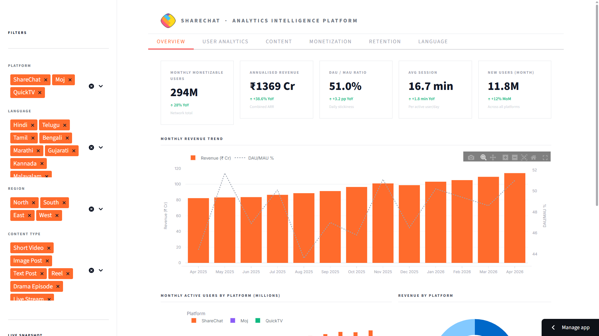
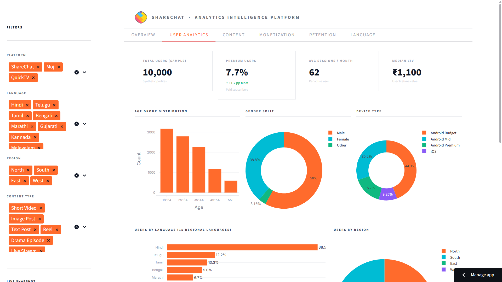
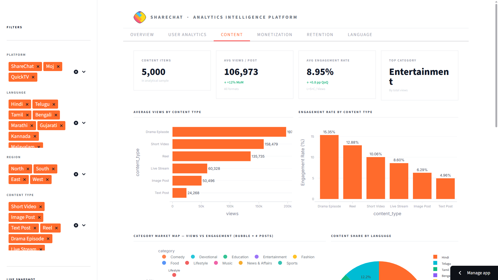
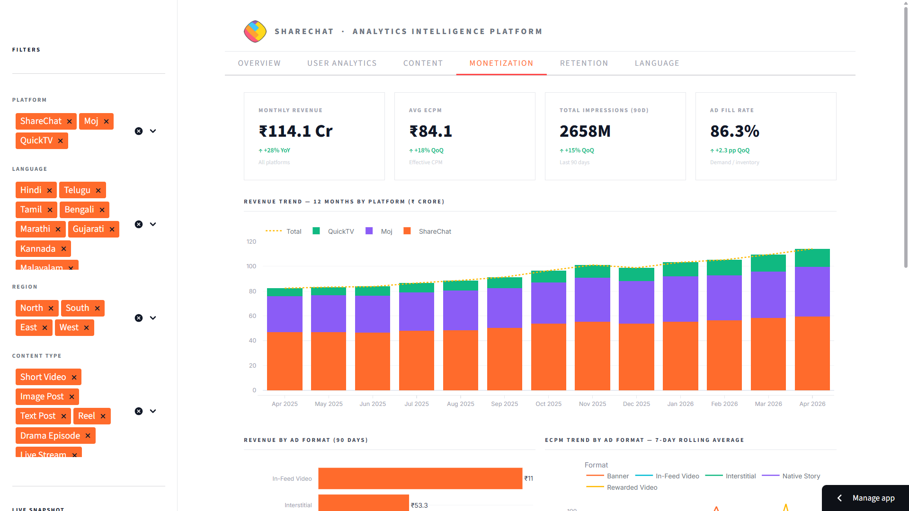
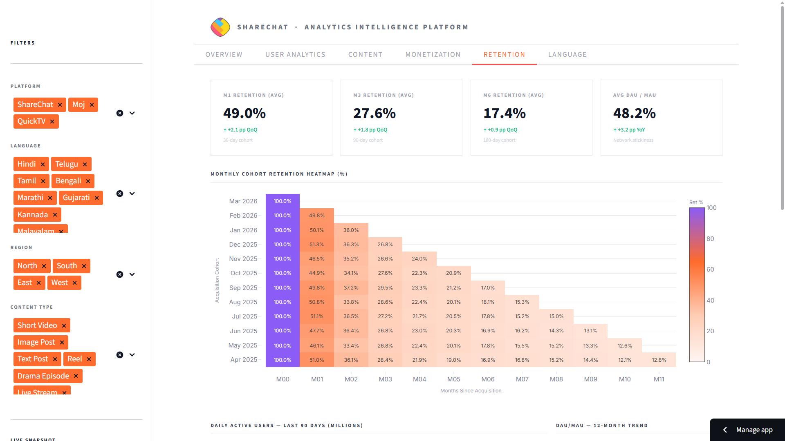
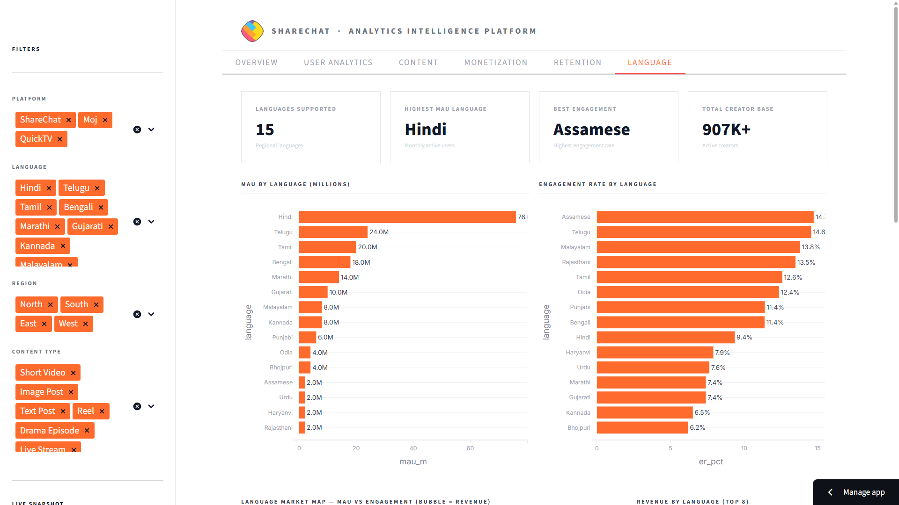

<div align="center">
  

  <h1>ShareChat Content Engagement Analytics</h1>

  <p><strong>An end-to-end product analytics system for a regional-language social platform — built to demonstrate the SQL depth, metric design, and analytical storytelling expected of a Product Analyst.</strong></p>

  <p>
    
    
    
    
    
  </p>
</div>

---

## Why This Project

Most "product analyst" portfolios are a Kaggle dataset, three charts in a notebook, and a short writeup. That doesn't mirror the actual job.

This project does. It generates a 3M-row synthetic event warehouse modeled on a real social platform's data shape, lands it in a star schema, runs 15 Redshift-compatible SQL queries against it, evaluates an A/B test with proper statistical rigor, and surfaces the findings through both a multi-page dashboard and a PM-style memo with concrete recommendations.

> **Scoping note.** This is deliberately a **product analytics** project, not a data science one. No ML models, no predictions. The questions a PM actually needs answered — *who's churning, where's the funnel drop-off, does this feature work* — are better answered with well-written SQL and clear metric definitions than with a black-box model. That scoping decision is itself a deliberate signal.

---

## Dashboard Preview

<table>
  <tr>
    <td width="50%"></td>
    <td width="50%"></td>
  </tr>
  <tr>
    <td><strong>Overview</strong> — Platform KPIs, revenue trend, MAU by platform</td>
    <td><strong>User Analytics</strong> — Language mix, device split, session behaviour</td>
  </tr>
  <tr>
    <td></td>
    <td></td>
  </tr>
  <tr>
    <td><strong>Content</strong> — Engagement rate by type, category market map</td>
    <td><strong>Monetisation</strong> — Revenue by format, eCPM trend, QoQ waterfall</td>
  </tr>
  <tr>
    <td></td>
    <td></td>
  </tr>
  <tr>
    <td><strong>Retention</strong> — Cohort heatmap, DAU trend, retention curve</td>
    <td><strong>Language</strong> — MAU, engagement, and revenue across 15 languages</td>
  </tr>
</table>

---

## Headline Findings

Every number below comes from running the actual SQL queries against the generated warehouse — they're reproducible end-to-end.

| # | Finding | Evidence |
|---|---------|----------|
| 1 | **Tier-3/4 users out-engage Tier-1 on time spent** | 26.1 min avg session vs 21.6 min for Tier-1 → **+20%** |
| 2 | **But monetisation is 5× behind** | Tier-1 ARPU ₹13.92 vs Tier-3 ARPU ₹2.66 → **5.2× gap** |
| 3 | **Android-Low has a crash-proxy problem** | 7.92% of sessions terminate < 10s vs ~0% on every other tier |
| 4 | **A/B variant ships** | +6.2% session duration, p < 0.001, holds across all major segments |
| 5 | **Ad CTR collapses down the tiers** | Tier-1 4.91% → Tier-2 3.51% → Tier-3 2.13% → Tier-4 1.80% |

The full reasoning, segment breakdowns, and recommended product actions live in [`reports/product_memo.md`](reports/product_memo.md).

---

## Architecture

```
┌─────────────────────────────────────────────────────────────────────────┐
│                                                                         │
│   01_generate_data.py     →    /data/raw/*.csv      (2.97M rows)        │
│        (NumPy, vectorised)                                              │
│                                                                         │
│   02_simulate_api_fetch.py  →  paginated fetch, retry, dedupe           │
│        (mirrors a real "fetch from internal events API" workflow)       │
│                                                                         │
│   03_build_warehouse.py   →   /data/warehouse/sharechat.db              │
│        (SQLite + 18 indexes; Redshift DISTKEY/SORTKEY documented)       │
│                                                                         │
│   04_data_quality_checks.py  →  8 DQ categories, written report         │
│                                                                         │
│         ↓                          ↓                          ↓         │
│   sql/01–15_*.sql         notebooks/*.ipynb           dashboard/app.py  │
│   (Redshift-compat)       (EDA + A/B + creator)       (8-page Streamlit)│
│                                                                         │
└─────────────────────────────────────────────────────────────────────────┘
```

**Star schema.** Fact tables (`events`, `sessions`, `ad_impressions`) join to dimensions (`users`, `creators`, `posts`). Designed so every SQL query in `/sql` would work unchanged on Redshift; the SQLite layer is just for portability.

---

## What's Inside

### Data & Pipeline (`src/`)

| File | Purpose |
|------|---------|
| `01_generate_data.py` | Vectorised generation of 2.97M rows across 7 tables — 50K users, 5K creators, 100K posts, 2M events, 500K sessions, 300K ad impressions. Behaviour modelled on publicly documented platform dynamics (tier effects, festival spikes, device-class drop-offs). |
| `02_simulate_api_fetch.py` | Simulates paginated API fetch with retry/backoff/deduplication — directly answers the JD's *"scripting to fetch from API endpoints"* requirement. |
| `03_build_warehouse.py` | Loads CSVs into a SQLite star schema with 18 indexes; Redshift equivalents (`DISTKEY`, `SORTKEY`, `DISTSTYLE ALL`) documented inline. |
| `04_data_quality_checks.py` | 8-category DQ suite: row counts, nulls, referential integrity, date validity, duplicates, test-user filtering, enum validation, distribution sanity. Outputs a written report. |

### SQL (`sql/`)

15 Redshift-compatible analytical queries, each paired with a business question and recommended PM action in `sql/README.md`:

```
01_engagement_metrics.sql        09_power_users.sql
02_retention_cohorts.sql         10_creator_retention.sql
03_content_performance.sql       11_language_cross_analysis.sql
04_creator_analytics.sql         12_session_patterns.sql
05_funnel_analysis.sql           13_festival_impact.sql
06_ab_test_analysis.sql          14_device_segmentation.sql
07_monetization_analysis.sql     15_cohort_ltv.sql
08_anomaly_detection.sql
```

Heavy use of window functions, CTEs, conditional aggregates, and statistical computation in pure SQL.

### Notebooks (`notebooks/`)

| Notebook | What it covers |
|----------|----------------|
| `01_exploratory_analysis.ipynb` | User distributions, session shape, festival effect, A/B preview |
| `02_ab_test_deep_dive.ipynb` | Power check → t-test → CI → segment cuts → Simpson's-paradox check → ship/no-ship recommendation |
| `03_creator_ecosystem.ipynb` | Power-law fit, Lorenz curve & Gini, streak analysis, category health |

### Dashboard (`dashboard/app.py`)

8-page Streamlit app reading directly from the SQLite warehouse:

`Overview` · `User Analytics` · `Content` · `Monetisation` · `Retention` · `Language` · `A/B Test` · `SQL Workbench` *(the SQL Workbench page lets a reviewer run any of the 15 queries live)*

### Reports & Docs

| File | Purpose |
|------|---------|
| [`reports/product_memo.md`](reports/product_memo.md) | **Keystone deliverable.** PM-style memo on the Tier-3/4 monetisation gap with quantified recommendations. |
| [`reports/metrics_definitions.md`](reports/metrics_definitions.md) | Every metric: formula, SQL, edge cases, common pitfalls. |
| [`docs/PROJECT_REPORT.md`](docs/PROJECT_REPORT.md) | 2,500-word technical writeup of decisions and trade-offs. |
| [`docs/SCHEMA_DIAGRAM.md`](docs/SCHEMA_DIAGRAM.md) | Star schema with design rationale (ASCII + Mermaid). |
| [`docs/DATA_DICTIONARY.md`](docs/DATA_DICTIONARY.md) | Every field in every table. |
| [`docs/DASHBOARD_GUIDE.md`](docs/DASHBOARD_GUIDE.md) | 5-minute interview demo script. |
| [`docs/INTERVIEW_PREP.md`](docs/INTERVIEW_PREP.md) | STAR answers, SQL prep, ShareChat context, numbers to memorise. |

---

## Tech Stack

| Layer | Choice | Why |
|-------|--------|-----|
| Data generation | Python + NumPy (vectorised) | ~20s for 3M rows; Faker would have taken 10× longer |
| API simulation | Python, `requests`-style pattern | Mirrors the "fetch from API" line item in the JD |
| Warehouse | SQLite | Zero-setup; queries are written in Redshift-compatible SQL throughout |
| SQL | 15 queries — windows, CTEs, statistical tests | Where the analytical depth lives |
| Notebooks | pandas, matplotlib, seaborn, scipy | EDA + statistical inference |
| Dashboard | Streamlit + Plotly | Fast to build, easy to demo, multi-page |
| Statistics | `scipy.stats` (t-test, chi-square, power) | Proper A/B inference, not eyeballed deltas |

---

## Run It

```bash
# 1. Install
pip install -r requirements.txt

# 2. Build the warehouse end-to-end (~2-3 min total)
python src/01_generate_data.py        # ~20s — 2.97M rows → data/raw/
python src/02_simulate_api_fetch.py   # ~70s — paginate, dedupe, refresh
python src/03_build_warehouse.py      # ~35s — SQLite star schema (547 MB)
python src/04_data_quality_checks.py  # ~10s — DQ report

# 3. Launch
streamlit run dashboard/app.py        # → http://localhost:8501

# Optional
jupyter lab notebooks/                # explore the analyses
```

---

## Project Structure

```
sharechat-analytics/
├── README.md
├── requirements.txt
├── assets/                   # logo, brand assets
├── data/
│   ├── raw/                  # generated CSVs (gitignored)
│   └── warehouse/            # SQLite DB + DQ report (gitignored)
├── src/                      # 4-script pipeline
├── sql/                      # 15 Redshift-compatible queries + README
├── notebooks/                # EDA, A/B deep-dive, creator analysis
├── dashboard/                # 8-page Streamlit app
├── reports/                  # product memo + metrics dictionary
└── docs/                     # schema, data dictionary, interview prep
```

---

## How This Maps to the JD

| JD requirement | Where it shows up |
|----------------|-------------------|
| SQL on a Redshift analytical engine | `sql/01–15_*.sql` — all Redshift-compatible |
| Scripting to fetch from API endpoints | `src/02_simulate_api_fetch.py` |
| Working with large user-behaviour data | 2M+ event rows, joined across the schema |
| Trend & pattern recognition | `sql/08_anomaly_detection.sql`, `sql/13_festival_impact.sql` |
| Segmentation | Tiering, RFM-style, language-cluster analysis |
| Statistics | `notebooks/02_ab_test_deep_dive.ipynb` |
| Reporting & presenting findings | `reports/product_memo.md`, dashboard, demo script |

---

## Author

Built as a portfolio project for the **ShareChat Product Analyst Internship**.
All data is synthetic; behavioural signals are modelled on publicly documented platform dynamics.

[LinkedIn](https://www.linkedin.com/in/alokthedataguy/) · [Portfolio](#) · [Email](alokdeep9925@gmail.com)
